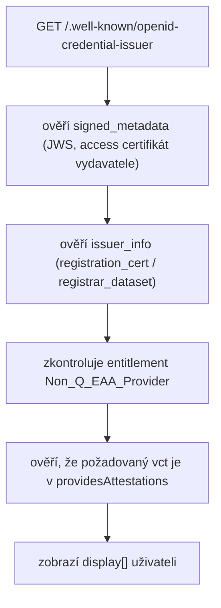
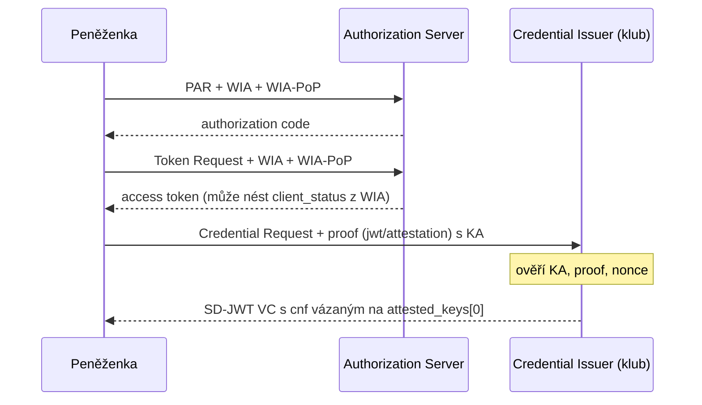

Tento článek prohlubuje [registraci vydavatele](/scenare/strelecky-klub/registrace-vydavatele) o provozní detaily: jak peněženka ověřuje metadata, jak probíhá vydání včetně **WIA a KA atestací** dle TS3, a jak klub spravuje revokaci průkazů.

## Tok ověření metadat peněženkou

Před zobrazením credential offer peněženka provede:



<details>
<summary>signed_metadata — struktura JWS payload (zjednodušeně)</summary>

**Protected header:**

```json
{
  "alg": "ES256",
  "typ": "JWT",
  "x5c": ["MIICKDCCAc2gAwIBAgIUdM4hwZVkIwdIIvSgiHTUA3WQFxMw…"]
}
```

**Payload:**

```json
{
  "iss": "https://issuer.walletmap-club.cz",
  "iat": 1781366400,
  "credential_issuer": "https://issuer.walletmap-club.cz",
  "credential_configurations_supported": { "…": "…" },
  "issuer_info": [
    { "format": "registration_cert", "data": "MIIC…" },
    { "format": "registrar_dataset", "data": { "…": "…" } }
  ]
}
```

Výsledný `signed_metadata` = `base64url(header).base64url(payload).base64url(signature)`.

Podpis: **privátní klíč** vázaný na access certifikát vydavatele (držitel issuer instance ho vytvořil při CSR a spravuje na serveru). Peněženka ověří JWS podpis veřejným klíčem z `x5c` a řetěz access certifikátu vůči [[LoTE]].

</details>

## Šifrování credential response

Pokud issuer v metadatech uvádí `credential_response_encryption` s `encryption_required: true`, peněženka musí v **Credential Requestu** přiložit objekt `credential_response_encryption` s vlastním veřejným klíčem (`jwk`). Issuer pak vrátí credential response jako [[JWE]] zašifrovaný tímto klíčem.

**Kde issuer získá šifrovací klíč:** veřejný klíč pro šifrování odpovědi issuer **nepublikuje v metadatech** a **nečerpá z access certifikátu** — v každém vydání ho převezme z příchozího Credential Requestu, z pole `credential_response_encryption.jwk`. Peněženka tam vloží efemérní veřejný klíč; odpovídající privátní klíč si ponechá a jím odpověď dešifruje. Issuer v metadatech uvádí jen podporované algoritmy (`alg_values_supported`, `enc_values_supported`) a příznak `encryption_required`.

<details>
<summary>credential_response_encryption — příklad a tok</summary>

**V metadatech issuer** (deklarace podpory, bez klíče peněženky):

```json
{
  "credential_response_encryption": {
    "alg_values_supported": ["ECDH-ES+A256KW"],
    "enc_values_supported": ["A256GCM"],
    "encryption_required": true
  }
}
```

**V Credential Requestu peněženky** (zdroj klíče pro issuer):

```json
{
  "credential_configuration_id": "club_membership_sd_jwt",
  "proofs": { "jwt": ["…"] },
  "credential_response_encryption": {
    "jwk": {
      "kty": "EC",
      "crv": "P-256",
      "x": "…",
      "y": "…"
    },
    "alg": "ECDH-ES+A256KW",
    "enc": "A256GCM"
  }
}
```

| Krok | Kdo | Co |
|------|-----|-----|
| 1 | Issuer | Publikuje podporované `alg` / `enc` a `encryption_required` v metadatech |
| 2 | Peněženka | Vygeneruje efemérní klíčový pár; veřejný klíč vloží do `credential_response_encryption.jwk` v Credential Requestu |
| 3 | Issuer | Zašifruje credential response jako JWE klíčem z `credential_response_encryption.jwk` v žádosti |
| 4 | Peněženka | Dešifruje JWE **privátním klíčem** z kroku 2 |

Účel: credential necestuje v plaintextu přes síť, i když je transport zabezpečen TLS. Pokud issuer v metadatech uvádí i `credential_request_encryption`, musí být podle OID4VCI šifrován i samotný Credential Request.

</details>

## Credential Offer — dva toky v klubu

### Pre-authorized code (schválení členství, startovní lístek)

Výbor schválí žádost → issuer vygeneruje offer bez interaktivního přihlášení:

<details>
<summary>credential_offer_uri — ClubMembership po schválení</summary>

```json
{
  "credential_issuer": "https://issuer.walletmap-club.cz",
  "credential_configuration_ids": ["club_membership_sd_jwt"],
  "grants": {
    "urn:ietf:params:oauth:grant-type:pre-authorized_code": {
      "pre-authorized_code": "SplxlOBeZQQYbYS6WxSbIA",
      "user_pin_required": false
    }
  }
}
```

</details>

Deeplink: `openid-credential-offer://?credential_offer_uri=https%3A%2F%2Fissuer…%2Foffer%2Fabc123`

### Authorization code (registrace závodníka — kombinovaná prezentace státních dokladů)

Závodník nejdřív projde OID4VP ověřením státních dokladů v **jedné kombinované prezentaci** (PID + zbrojní oprávnění), pak issuer nabídne CompetitorLicense:

<details>
<summary>credential_offer — CompetitorLicense (authorization_code)</summary>

```json
{
  "credential_issuer": "https://issuer.walletmap-club.cz",
  "credential_configuration_ids": ["competitor_license_sd_jwt"],
  "grants": {
    "authorization_code": {
      "issuer_state": "sess-reg-zavodnik-2026-0187"
    }
  }
}
```

</details>

<a id="wua-wia-ka"></a>

## Wallet Unit Attestations (WUA) — WIA a KA při vydání

Dle **TS3** (EC TS03, aktuálně v1.5) a revidovaného **ARF Topic 9** se pojem **Wallet Unit Attestation (WUA)** používá jako **deštníkový termín** pro dvě samostatné atestace peněženky při vydávání:

| Atestace | Co potvrzuje | Kam ji peněženka posílá | Kdy je povinná |
|----------|--------------|-------------------------|----------------|
| [[WIA]] | integritu a autenticitu **Wallet Instance** (aplikace) | **Authorization Server** — v PAR a Token Request jako OAuth Client Attestation | při vydání PID i všech atestací (device-bound i non-device-bound) |
| [[KA]] | bezpečnost **úložiště klíčů** (WSCD nebo keystore) a veřejných klíčů v něm | **Credential Issuer** — v poli `proofs` Credential Requestu (`jwt` nebo `attestation` proof type) | pouze u **device-bound** atestací vázaných na klíč (`cnf`) |

Klubové průkazy (`ClubMembership`, `CompetitorLicense`, `CompetitionEntry`) jsou v tomto modelu **device-bound** — issuer je váže na holder klíč v `cnf`. Peněženka proto při jejich vydání posílá **WIA i KA**.

### Tok vydání — kde která atestace vstupuje



WIA a KA cestují **oddělenými kanály** OID4VCI/OAuth. Issuer (Credential Issuer) přímo vidí KA a proof; informace z WIA (zejména `client_status`) musí dostat od Authorization Serveru — typicky přes access token nebo interní vazbu mezi AS a issuer instancí klubu.

### WIA — Wallet Instance Attestation

WIA je JWT podepsaný **Wallet Providerem** (`x5c` v hlavičce, ověření vůči Trusted List for Wallet Providers). Peněženka ji posílá jako `OAuth-Client-Attestation` spolu s `OAuth-Client-Attestation-PoP` (dle OID4VCI Appendix E).

**Technická platnost** WIA je krátká — TS3 vyžaduje TTL **méně než 24 hodin** (`exp` na úrovni tokenu). To zajišťuje, že integrita aplikace byla ověřena nedávno.

**Revokační údržba** je nezávislá: objekt `client_status` nese odkaz na status list (`status`) a závazek Wallet Providera udržovat revokační stav do `client_status.exp`:

<details>
<summary>WIA — zjednodušený payload (TS3 + OID4VCI Appendix E)</summary>

```json
{
  "sub": "https://client.wallet.example",
  "wallet_name": "EUDI-Wallet-CZ",
  "wallet_version": "2.1.0",
  "wallet_link": "https://wallet-provider.example/info",
  "wallet_solution_certification_information": "https://wallet-provider.example/cert/2-1-0/",
  "exp": 1781452800,
  "client_status": {
    "status": {
      "status_list": {
        "idx": 1337,
        "uri": "https://wallet-provider.example/statuslists/wia/42"
      }
    },
    "exp": 1784044800
  },
  "cnf": {
    "jwk": {
      "kty": "EC",
      "crv": "P-256",
      "x": "18wHLeIgW9wVN6VD1Txgpqy2LszYkMf6J8njVAibvhM",
      "y": "-V4dS4UaLMgP_4fY4j8ir7cl1TXlFdAgcx55o7TkcSA"
    }
  }
}
```

| Claim | Význam |
|-------|--------|
| `exp` (token) | technické vypršení WIA (&lt; 24 h) |
| `client_status.status` | **stav Wallet Instance** na status listu WP — ne revokace samotného JWT |
| `client_status.exp` | do kdy WP garantuje udržování revokačního záznamu na daném indexu |
| `cnf` | klíč pro WIA Proof-of-Possession |

</details>

**Co issuer (klub) ověřuje u WIA** (přes AS nebo předaný kontext):

1. podpis WIA a WIA-PoP vůči certifikátu WP na Trusted List
2. WIA neexpirovala (`exp`)
3. `client_status` není revokovaný (kontrola status listu)
4. volitelně: `wallet_name`, `wallet_version`, certifikační údaje řešení peněženky

### KA — Key Attestation a holder proof

KA je JWT (`keyattestation+jwt`) v elementu `key_attestation` uvnitř proof typu `jwt` nebo `attestation` (OID4VCI Appendix D, rozšířený o EUDI claims dle TS3). Při `jwt` proof typu peněženka **podepíše celý proof** klíčem na indexu 0 v `attested_keys` — tím dokazuje držení soukromého klíče, na který issuer naváže `cnf` ve vydaném průkazu.

<details>
<summary>Credential Request — proof s KA (OID4VCI, device-bound)</summary>

```json
{
  "credential_configuration_id": "club_membership_sd_jwt",
  "proofs": {
    "jwt": [
      "eyJ0eXAiOiJvcGVuaWQ0dmNpLXByb29mK2p3dCIsImFsZyI6IkVTMjU2Iiwia2V5X2F0dGVzdGF0aW9uIjoiZXlKLi4uIn0.eyJhdWQiOiJodHRwczovL2lzc3Vlci53YWxsZXRtYXAtY2x1Yi5jeiIsImlhdCI6MTc4MTM2NjQwMCwibm9uY2UiOiJMYXJSR1NibVVQWXRZUk82QlE0eW44In0.c2ln..."
    ]
  }
}
```

Dekódovaný header `jwt` proofu obsahuje `key_attestation` (KA JWT). Payload obsahuje `aud` (issuer), `nonce` z `nonce_endpoint` a `iat`.

</details>

<details>
<summary>KA (`key_attestation`) — zjednodušený payload</summary>

```json
{
  "iat": 1781366400,
  "exp": 1783958400,
  "certification": "https://wallet-provider.example/cert/wscd/GlobalPlatform/",
  "key_storage_status": {
    "status": {
      "status_list": {
        "idx": 7,
        "uri": "https://wallet-provider.example/statuslists/ka-type/3"
      }
    },
    "exp": 1786540800
  },
  "attested_keys": [
    {
      "kty": "EC",
      "crv": "P-256",
      "x": "TCAER19Zvu3OHF4j4W4vfSVoHIP1ILilDls7vCeGemc",
      "y": "ZxjiWWbZMQGHVWKVQ4hbSIirsVfuecCE6t4jT2F2HZQ"
    }
  ],
  "key_storage": ["iso_18045_high"],
  "user_authentication": ["iso_18045_high", "iso_18045_moderate"]
}
```

| Claim | Význam |
|-------|--------|
| `exp` (token) | technické vypršení KA (může být delší než u WIA) |
| `key_storage_status.status` | revokační stav **typu** WSCD/keystore (sdílený index) nebo **instance** (per-KA index dle volby WP) |
| `key_storage_status.exp` | závazek WP udržovat revokační stav úložiště klíčů |
| `attested_keys[0]` | veřejný klíč, na který issuer naváže `cnf` v průkazu |

</details>

**Co issuer (klub) ověřuje u KA** (dle OID4VCI Appendix F.4 + TS3):

1. podpis KA vůči certifikátu WP na Trusted List
2. platný `c_nonce` / `nonce` z `nonce_endpoint`
3. u `jwt` proof: podpis proofu klíčem `attested_keys[0]`
4. `key_storage_status` není revokovaný
5. `key_storage` odpovídá požadované úrovni ochrany klíčů

Po ověření issuer vydá SD-JWT VC s `cnf` claimem vázaným na `attested_keys[0]`.

### Rozdíl: platnost WIA/KA vs. stav peněženky

Důležité rozlišení z TS3 a ARF revizního kola (Topic C):

| Koncept | Co měří | Typická délka | Kdo spravuje status list |
|---------|---------|---------------|--------------------------|
| `exp` na WIA/KA JWT | technická platnost **atestačního tokenu** | WIA &lt; 24 h; KA dle WP | — |
| `client_status` ve WIA | zda je **Wallet Instance** (aplikace / zařízení) stále důvěryhodná | `client_status.exp` — často týdny až měsíce | Wallet Provider |
| `key_storage_status` v KA | zda je **WSCD/keystore** (typ nebo instance) stále důvěryhodný | `key_storage_status.exp` — často týdny až měsíce | Wallet Provider |

Revokace WIA/KA **neznamená** revokaci samotného JWT atestátu jako artefaktu — status list vyjadřuje revokaci **podkladového objektu** (instance peněženky nebo úložiště klíčů). Naproti tomu revokace klubového průkazu (níže) je v kompetenci **vydavatele (klubu)**.

**Příklady událostí:**

- uživatel nahlásí ztrátu telefonu → WP revokuje `client_status` příslušné Wallet Instance
- zranitelnost v konkrétním čipu WSCD → WP revokuje `key_storage_status` (u type-shared indexu všechny peněženky daného typu)
- ztráta externí smart karty (per-KA index) → WP revokuje `key_storage_status` instance na žádost uživatele
- vyloučení člena klubu → **klub** revokuje `ClubMembership` na vlastním status listu — nezávisle na WP

### Sledování revokace po vydání (revocation chaining)

Pro [[PID]] PID Provider povinně kontroluje revokační stav WIA i KA **minimálně jednou za 24 hodin** po celou dobu platnosti PID a při revokaci kterékoli z nich revokuje PID.

U **ne-PID atestací** (klubové průkazy) je sledování revokace WIA/KA **volitelné**, ale doporučené, pokud issuer chce reagovat na kompromitaci peněženky nebo úložiště klíčů. Pokud issuer tuto kontrolu provádí, technická platnost průkazu by měla končit nejpozději v okamžiku `client_status.exp` a `key_storage_status.exp` z atestací předložených při vydání.

Issuer by si při vydání měl uložit:

- `client_status.status` (idx + uri) z WIA — identifikátor Wallet Instance
- `key_storage_status.status` z KA — stav úložiště klíčů
- thumbprint holder klíče z `cnf` ve vydaném průkazu

Při **re-vydání** (např. prodloužení sezóny `CompetitorLicense`) peněženka musí použít **novou KA**, která ještě nebyla použita (TS3 §2.4.2).

### Metadata vydavatele — požadavky na WUA

Issuer metadata signalizují potřebu obou atestací:

<details>
<summary>issuer metadata — preferred_client_status_period a key_attestation_required</summary>

```json
{
  "credential_issuer": "https://issuer.walletmap-club.cz",
  "preferred_client_status_period": 2678400,
  "credential_configurations_supported": {
    "club_membership_sd_jwt": {
      "format": "dc+sd-jwt",
      "cryptographic_binding_methods_supported": ["jwk"],
      "proof_types_supported": {
        "jwt": {
          "proof_signing_alg_values_supported": ["ES256"],
          "key_attestation_required": {
            "key_storage": ["iso_18045_high"],
            "user_authentication": ["iso_18045_moderate"],
            "preferred_key_storage_status_period": 2678400
          }
        },
        "attestation": {
          "key_attestation_required": {
            "key_storage": ["iso_18045_high"],
            "preferred_key_storage_status_period": 2678400
          }
        }
      }
    }
  }
}
```

`preferred_client_status_period` (na úrovni issuer metadat) a `preferred_key_storage_status_period` (v `key_attestation_required`) říkají peněžence, jak dlouhou **zbývající revokační údržbu** issuer očekává — peněženka vybere WIA/KA s co nejkratším přebytkem nad touto preferencí.

</details>

Authorization Server klubu paralelně publikuje v metadatech požadavek na [[WIA]].

## Vydaný průkaz — příklad ClubMembership

<details>
<summary>SD-JWT VC payload (disclosed claims)</summary>

```json
{
  "iss": "https://issuer.walletmap-club.cz",
  "iat": 1781366400,
  "vct": "urn:walletmap:club:membership:1",
  "member_id": "SK-2026-0042",
  "given_name": "Jan",
  "family_name": "Novák",
  "membership_level": "řadový člen",
  "roles": ["správce střelnice"],
  "status": "aktivní",
  "valid_from": "2026-01-01",
  "valid_until": "2026-12-31",
  "cnf": { "jwk": { "…": "…" } }
}
```

</details>

## Revokace a status list

Klub musí zneplatnit průkaz při vyloučení, ukončení členství nebo odhlášení ze závodu. Tato **revokace průkazu** je nezávislá na revokaci WIA/KA spravované Wallet Providerem — viz [WIA a KA při vydání](#wua-wia-ka). Issuer může volitelně sledovat `client_status` a `key_storage_status` z vydání a při jejich revokaci proaktivně zneplatnit i vydané průkazy.

Pro revokaci průkazů issuer publikuje **Token Status List** (IETF [draft-ietf-oauth-status-list](https://datatracker.ietf.org/doc/html/draft-ietf-oauth-status-list)) — při vydání vloží do SD-JWT VC claim `status.status_list` s `uri` a `idx`. Ověřovatel a peněženka stav kontrolují stažením Status List Token z `uri`.

**OID4VCI `notification_endpoint`** slouží k opačnému směru: peněženka informuje issuer o výsledku *vydání* (`credential_accepted`, `credential_failure`, `credential_deleted`) — **nikoli** k oznámení revokace issuerem.

→ **Detailní prohloubení:** [Revokace a status list](/scenare/strelecky-klub/revokace-a-status-list) — mechanismy, odpovědnosti, kontrolní postupy, komplementarita notification vs. status list.

## Issuer metadata podle role vydávání

Klub vydává ze **jedné issuer instance**, ale metadata rozlišují tři konfigurace. Každá má vlastní `scope` pro authorization server:

| configuration_id | scope | Kdo iniciuje | Grant type |
|------------------|-------|--------------|------------|
| `club_membership_sd_jwt` | `club_membership` | výbor po schválení | pre-authorized_code |
| `competitor_license_sd_jwt` | `competitor_license` | závodník po registraci | authorization_code |
| `competition_entry_sd_jwt` | `competition_entry` | závodník po platbě startovného | pre-authorized_code |

<details>
<summary>authorization_server — scope mapování</summary>

```json
{
  "scopes_supported": [
    "club_membership",
    "competitor_license",
    "competition_entry"
  ],
  "scope_to_credential": {
    "club_membership": ["club_membership_sd_jwt"],
    "competitor_license": ["competitor_license_sd_jwt"],
    "competition_entry": ["competition_entry_sd_jwt"]
  }
}
```

</details>

## Vazba na scénáře

| Operace | Scénář |
|---------|--------|
| Vydání členství | [Schválení a vydání](/scenare/strelecky-klub/schvaleni-a-vydani-clenstvi) |
| Revokace členství | [Obnova a ukončení](/scenare/strelecky-klub/obnova-a-ukonceni-clenstvi) |
| Vydání závodníka | [Vydání průkazu závodníka](/scenare/strelecky-klub/vydani-prukazu-zavodnika) |
| Startovní lístek | [Registrace na soutěž](/scenare/strelecky-klub/registrace-na-soutez) |

Pro ověřování státních dokladů před vydáním závodníka klub vystupuje jako RP — viz [Registrace RP](/scenare/strelecky-klub/registrace-rp) a [RP certifikáty a verifier](/scenare/strelecky-klub/rp-certifikaty-a-verifier).
