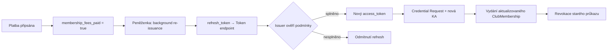

Členství je **roční**. Klubový průkaz (`ClubMembership`) podporuje **automatickou obnovu na pozadí** — peněženka obnoví credential bez opětovného schvalování výborem, pokud v klubovém systému trvá podmínka zaplacených členských příspěvků. Člen může členství ukončit, nebo může být vyloučen rozhodnutím výboru.

## Podmínky automatické obnovy

Obnova probíhá **mimo platební tok peněženky** — klub eviduje stav příspěvků ve vlastním ekonomickém systému a issuer ověřuje příznak `membership_fees_paid` v členské databázi. Peněženka se nepodílí na platbě ani na rozhodování o způsobilosti.

| Podmínka | Zdroj | Požadavek pro obnovu |
|----------|-------|----------------------|
| Zaplacené členské příspěvky | ekonomický systém klubu | `membership_fees_paid = true` pro aktuální rok |
| Platné členství | členská databáze | `status ≠ vyloučený` a `status ≠ ukončené` |
| Uložený refresh token | peněženka (z počátečního vydání) | platný `refresh_token` z [[OID4VCI]] vydání |

Systém klubu **průběžně eviduje**, zda podmínky pro obnovu trvají. Při každém pokusu o refresh issuer znovu ověří stav v interních záznamech — neobnovuje credential slepě.

## Automatická obnova členství

### User journey — člen

1. Před koncem platnosti obdrží upozornění (e-mail, v aplikaci klubu)
2. Zaplatí roční příspěvek přes platební bránu klubu (mimo [[EUDIW]])
3. Ekonomický systém nastaví `membership_fees_paid = true` v členské databázi
4. **Peněženka na pozadí** iniciuje obnovu credentialu pomocí uloženého `refresh_token` (background re-issuance)
5. Člen obdrží notifikaci: „Klubový průkaz byl automaticky prodloužen"
6. Nový průkaz je platný další rok — bez nutnosti potvrzovat credential offer

Pokud člen příspěvek nezaplatí včas, podmínka obnovy nesplněna → issuer odmítne refresh a peněženka informuje uživatele.

### Technický průběh — obnova na pozadí



Klíčové kroky:

1. Při **počátečním vydání** issuer vrátí spolu s `access_token` i `refresh_token` (dle [[OID4VCI]] § Token Response)
2. Peněženka uloží metadata vydání a `refresh_token` pro budoucí obnovu
3. Před vypršením platnosti (nebo po připsání platby) peněženka zavolá `reissueDocument(backgroundOnly: true)`
4. Issuer na token endpointu ověří `refresh_token` a dotáže se členské databáze na `membership_fees_paid`
5. Při splnění podmínek vydá nový `ClubMembership` s aktualizovaným `valid_until` a `status: aktivní`
6. Starý průkaz se **revokuje** na status listu (nový `idx`)

### Úkoly vydavatele

- Při vydání vrátit `refresh_token` s platností odpovídající obnovitelnému období
- Při refresh požadavku ověřit `membership_fees_paid` v ekonomickém systému klubu
- Vydat aktualizovaný průkaz s novým `valid_until` a `status: aktivní`
- Starý průkaz **revokovat** na status listu
- Zaznamenat událost obnovy do auditu (včetně výsledku ověření podmínek)

### Konfigurace issuer metadat

Obě credential konfigurace klubu (`club_membership_sd_jwt`, `competitor_license_sd_jwt`) podporují automatickou obnovu. U `club_membership_sd_jwt` issuer signalizuje podporu refresh v metadatech:

<details>
<summary>issuer metadata — podpora credential refresh</summary>

```json
{
  "credential_configurations_supported": {
    "club_membership_sd_jwt": {
      "format": "dc+sd-jwt",
      "credential_refresh": true,
      "refresh_token_expires_in": 31536000
    }
  }
}
```

</details>

## Nezaplacený příspěvek

Pokud člen nezaplatí včas:

1. `membership_fees_paid` se nastaví na `false`; `status` se změní na `ke obnově` nebo `pozastaveno`
2. Systém označí podmínku obnovy jako **nesplněnou** — další pokus o background refresh bude odmítnut
3. Zámek střeliště při ověření odmítne přístup (platnost vypršela)
4. Po doplacení se `membership_fees_paid` obnoví na `true` a peněženka může znovu iniciovat automatickou obnovu

## Dobrovolné ukončení

### User journey — člen

1. Požádá o ukončení v klubové aplikaci nebo písemně
2. Výbor potvrdí přijetí ukončení
3. Klub **revokuje** `refresh_token` a klubový průkaz
4. V peněžence průkaz zmizí nebo se označí jako neplatný

## Vyloučení

1. Výbor rozhodne o vyloučení (dle statutu)
2. Administrátor v aplikaci nastaví `status: vyloučený` a `membership_fees_paid: false`
3. Issuer **revokuje** `refresh_token` a provede okamžitou revokaci průkazu
4. Všechny verifikátory (zámky, aplikace) odmítnou průkaz

## Dopad na související průkazy

| Situace | Klubový průkaz | Průkaz závodníka | Startovní lístek |
|---------|:--------------:|:----------------:|:----------------:|
| Automatická obnova | aktualizace (background) | beze změny | beze změny |
| Ukončení | revokace + zrušení refresh tokenu | zvážit revokaci | zrušit budoucí |
| Vyloučení | revokace + zrušení refresh tokenu | revokace | zrušit vše |

Pravidla pro závodníka při ukončení členství závisí na statutu — závodník nemusí být totožný s členem klubu.

## Obnova po ztrátě zařízení

Tento scénář řeší **roční obnovu na stejném telefonu** pomocí `refresh_token`. Pokud člen **ztratí zařízení** nebo přejde na novou peněženku, `refresh_token` z původní instance nelze použít — nutné je **nové vydání** klubového průkazu dle procesu migrace. Viz [Zálohování a obnova peněženky](/scenare/strelecky-klub/zalohovani-a-obnova-penazenky).
