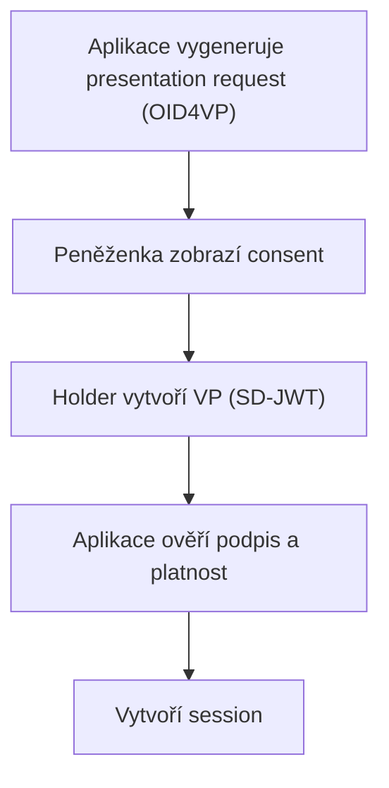

Klubová webová aplikace slouží ke správě členů, schvalování žádostí a organizaci závodů. Přihlášení probíhá **prezentací klubového průkazu** z peněženky — bez hesla.

## User journey — člen

1. Na webu klubu klikne **Přihlásit se peněženkou**
2. Zobrazí se QR kód nebo deeplink pro peněženku
3. V peněžence vidí žádost:
   - *„Střelecký klub Brno žádá o ověření vašeho členského průkazu"*
   - požadované atributy: `member_id`, `membership_level`, `roles`, `status`
4. Člen zkontroluje a potvrdí
5. Aplikace ho přihlásí a zobrazí dashboard dle role

## User journey — člen výboru

Stejný postup, ale aplikace na základě atributů `membership_level` a `roles` zobrazí navíc:

- schvalovací frontu žádostí
- správu členské databáze
- přehled plateb a obnov

## Technický průběh — ověřovatel (Relying Party)

Úkoly ověřovatele:

1. Definovat **presentation definition** pro typ `ClubMembership`
2. Ověřit podpis vydavatele (klubu) a platnost průkazu
3. Zkontrolovat `status` = `aktivní` a `valid_until` > nyní
4. Mapovat atributy na oprávnění v aplikaci

## Odmítnutí přihlášení

Aplikace odmítne přihlášení pokud:

- průkaz je revokovaný nebo expirovaný
- `status` není `aktivní`
- požadované atributy nejsou sdíleny

## UX principy

- Jednoznačný název žádající strany (klub)
- Viditelný seznam sdílených atributů
- Možnost odmítnout bez sankce
- Rychlé opětovné přihlášení (session) bez opakované prezentace
