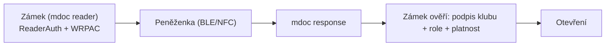

Elektronické zámky **zázemí** (šatny, sklad, technické místnosti) otevírají pouze držitelé role **správce střelnice** na klubovém průkazu.

## User journey — správce střelnice

1. Přistoupí k zámku zázemí
2. Zámek zobrazí QR kód nebo aktivuje NFC čtečku
3. Správce v peněžence potvrdí prezentaci klubového průkazu
4. Sdílí atributy: `roles` (obsahuje `správce střelnice`), `status`, `valid_until`
5. Zámek ověří a otevře dveře
6. V logu zázemí se zapíše čas a `member_id`

## Technický průběh — zámek jako proximity reader

Zámek zázemí je **RP Instance** v proximity režimu — komunikuje s peněženkou přes **ISO/IEC 18013-5** (NFC/BLE), nikoli přes [[OID4VP]]. Autenticita čtečky se prokazuje `ReaderAuth` podepsaným [[WRPAC]].

Presentation definition zámku zázemí (mdoc request):

- typ: `ClubMembership`
- požadované atributy: `roles` obsahuje `správce střelnice`
- podmínka: `status` = `aktivní`, `valid_until` > nyní

## Odmítnutí přístupu

| Situace | Důvod |
|---------|-------|
| Řadový člen bez role správce | Chybí oprávnění |
| Expirovaný průkaz | Členství neplatné |
| Revokovaný průkaz | Průkaz zrušen |
| Role odebrána, starý průkaz | Status list ukazuje revokaci |

## Správa oprávnění

Přidání nebo odebrání role správce probíhá ve scénáři **Změna role člena**. Zámky automaticky reflektují aktuální stav — není třeba je ručně konfigurovat pro každého správce.

## Bezpečnostní principy

- Zámek neukládá biometrické údaje — pouze ověřuje kryptografický průkaz
- Log přístupů je k dispozici výboru pro audit
- Při ztrátě telefonu správce může výbor dočasně odebrat roli (okamžitá revokace)
