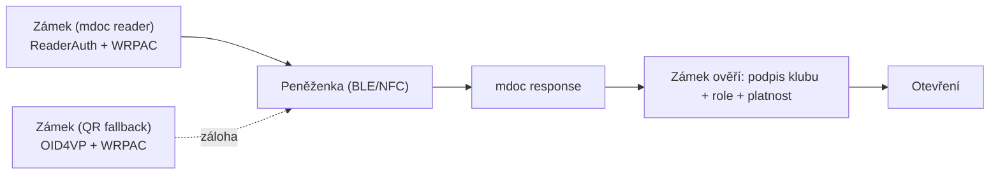

Elektronické zámky **zázemí** (šatny, sklad, technické místnosti) otevírají pouze držitelé role **správce střelnice** na klubovém průkazu.

## User journey — správce střelnice

1. Přistoupí k zámku zázemí
2. Přiloží telefon k NFC čtečce (nebo naváže BLE spojení) — **primární kanál**
3. V peněžence potvrdí proximity prezentaci (ISO/IEC 18013-5)
4. Sdílí atributy: `roles` (obsahuje `správce střelnice`), `status`, `valid_until`
5. Zámek ověří a otevře dveře
6. V logu zázemí se zapíše čas a `member_id`

Pokud NFC/BLE selže (poškozená anténa, slabý signál), zámek zobrazí **QR kód** a přepne do záložního **vzdáleného [[OID4VP]]** režimu — stejný intended use (`iu-zamek-zazemi`), jiný transport.

## Technický průběh — hybridní zámek

Zámek zázemí je **RP Instance** se dvěma režimy:

| Priorita | Kanál | Protokol | Kdy |
|----------|-------|----------|-----|
| 1 | NFC / BLE | ISO/IEC 18013-5 (`ReaderAuth` + [[WRPAC]]) | standardní přístup |
| 2 | QR na displeji | [[OID4VP]] (vzdálený) | selhání proximity |

Presentation definition zámku zázemí (mdoc request v primárním režimu):

- typ: `ClubMembership`
- požadované atributy: `roles` obsahuje `správce střelnice`
- podmínka: `status` = `aktivní`, `valid_until` > nyní

## Odmítnutí přístupu

| Situace | Důvod |
|---------|-------|
| Řadový člen bez role správce | Chybí oprávnění |
| Expirovaný průkaz | Členství neplatné |
| Revokovaný průkaz | Průkaz zrušen |
| Role odebrána, starý průkaz | Status list ukazuje revokaci |

## Správa oprávnění

Přidání nebo odebrání role správce probíhá ve scénáři **Změna role člena**. Zámky automaticky reflektují aktuální stav — není třeba je ručně konfigurovat pro každého správce.

## Bezpečnostní principy

- Zámek neukládá biometrické údaje — pouze ověřuje kryptografický průkaz
- Log přístupů je k dispozici výboru pro audit
- Při ztrátě telefonu správce může výbor dočasně odebrat roli (okamžitá revokace)
