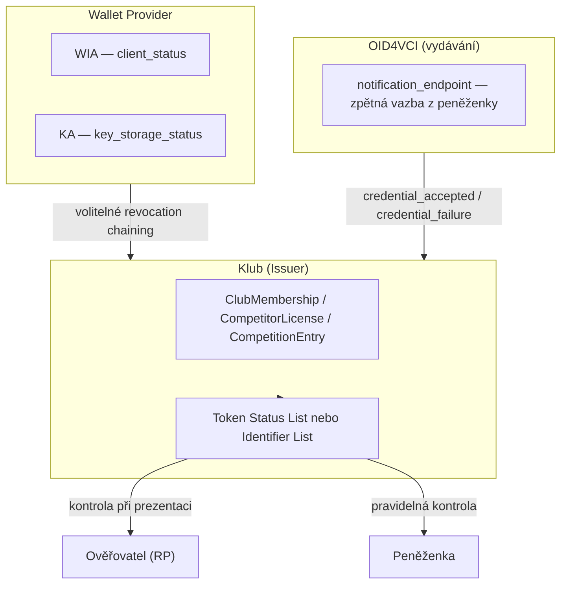
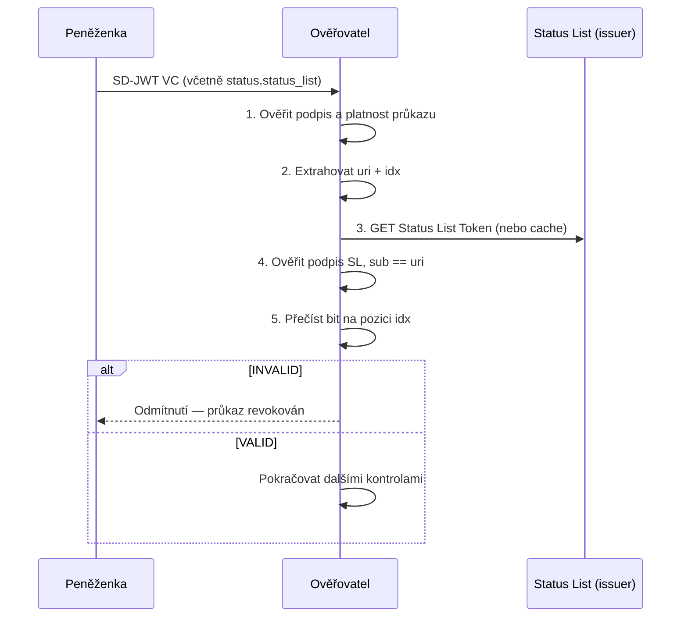
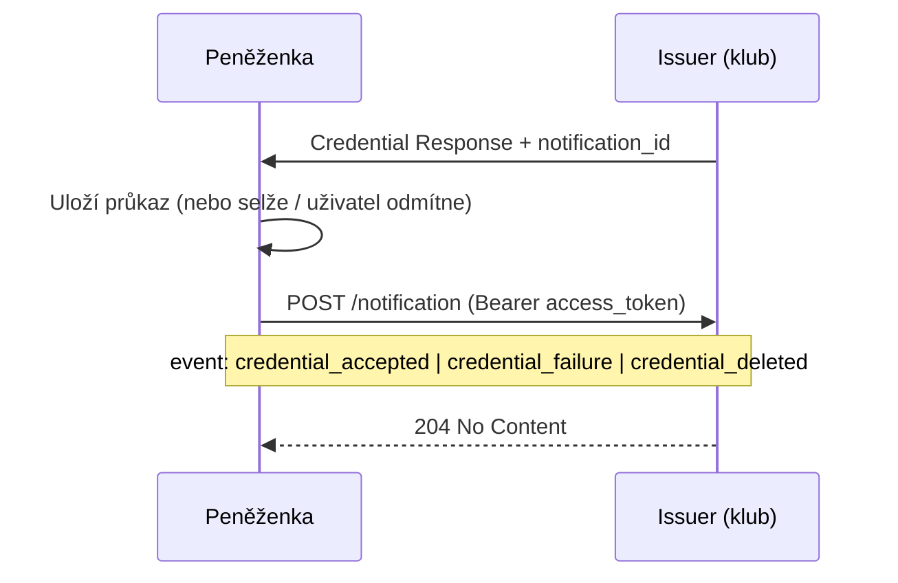

Tento článek prohlubuje sekci [Revokace a status list](/scenare/strelecky-klub/issuer-prohloubeni-vydavani#revokace-a-status-list) o normativní detaily: **kdo** provádí revokaci, **kde** se získávají URI a identifikátory, **jak** ověřovatel a peněženka kontrolují stav, a zda jednotlivé mechanismy jsou alternativy nebo se doplňují.

## Tři nezávislé vrstvy revokace

V ekosystému klubu existují tři oddělené revokační domény. Záměna jejich rolí vede k chybné implementaci — zejména u OID4VCI notification endpointu (viz níže).



| Vrstva | Co se revokuje | Kdo spravuje | Mechanismus | Specifikace |
|--------|----------------|--------------|-------------|-------------|
| [[WIA]] | Wallet Instance (aplikace / zařízení) | Wallet Provider | `client_status.status.status_list` | TS3, OID4VCI Appendix E, [IETF Token Status List](https://datatracker.ietf.org/doc/html/draft-ietf-oauth-status-list) |
| [[KA]] | WSCD / keystore | Wallet Provider | `key_storage_status.status.status_list` | TS3, OID4VCI Appendix D |
| **Průkaz klubu** | Konkrétní vydaný atestát | Klub (Issuer) | `status.status_list` nebo `status.identifier_list` ve vydaném tokenu | ARF VCR_01, IETF Token Status List / Identifier List |
| **Zpětná vazba vydávání** | Stav *přijetí* credentialu v peněžence | Peněženka → Issuer | OID4VCI `notification_endpoint` | OID4VCI §11 |

Revokace průkazu klubu **není** revokace WIA/KA a naopak. Issuer může volitelně sledovat `client_status` a `key_storage_status` z vydání a při jejich revokaci proaktivně zneplatnit i vydané průkazy — viz [revocation chaining](/scenare/strelecky-klub/issuer-prohloubeni-vydavani#sledovani-revokace-po-vydani-revocation-chaining).

## Přehled mechanismů u průkazů klubu

ARF Topic 7 (VCR_01) určuje, že vydavatel dlouhodobě platných atestací musí zvolit **jeden** z těchto přístupů:

1. **Krátkodobé atestáty** — platnost ≤ 24 hodin, revokace není nutná
2. **Attestation Status List** — bitový seznam stavů (index `idx` v seznamu)
3. **Attestation Revocation List** (Identifier List) — seznam identifikátorů revokovaných tokenů

Klubové průkazy mají platnost řádově měsíců až rok, proto se v praxi používá bod 2 nebo 3. ARF VCR_12 vyžaduje, aby **ověřovatel** podporoval **oba** mechanismy (status list i identifier list), pokud chce kontrolovat revokaci. **Vydavatel** si zvolí jeden z nich pro publikaci revokací svých průkazů; peněženka a ověřovatel musí umět oba přečíst.

| Mechanismus | Primární účel | Směr informace | Vhodné pro |
|-------------|---------------|----------------|------------|
| **Token Status List** | Publikace stavu mnoha tokenů bez dotazu na konkrétní `jti` | Issuer → RP / peněženka | Online i offline ověření, herd privacy |
| **Identifier List** | Seznam konkrétních revokovaných identifikátorů | Issuer → RP / peněženka | Jednodušší model (analogie k CRL), menší počet revokací |
| **OID4VCI Notification** | Potvrzení výsledku *vydání* (uložení v peněžence) | Peněženka → Issuer | Audit vydávání, nikoli revokace issuerem |
| **Krátká platnost (≤ 24 h)** | Vyhnout se revokaci | — | Nepoužitelné pro roční členské průkazy |

**Komplementarita:** Status list (nebo identifier list) a notification endpoint **nejsou alternativy** — řeší různé problémy. Issuer klubu by měl:

- provozovat **status list** (nebo identifier list) pro revokaci průkazů,
- volitelně publikovat **`notification_endpoint`** pro zpětnou vazbu z peněženky po vydání.

Oba mechanismy lze používat **současně**.

---

## 1. Token Status List (doporučený mechanismus)

Normativní základ: [IETF draft-ietf-oauth-status-list](https://datatracker.ietf.org/doc/html/draft-ietf-oauth-status-list), mapování v ARF jako **Attestation Status List** (VCR_11). OID4VCI tento draft explicitně referencuje (§14.7).

### Princip

Issuer při vydání alokuje **index** `idx` v bitovém poli Status List Token (JWT). Každý bit (typicky 1 bit = platný/neplatný) vyjadřuje stav jednoho referenčního tokenu. Při revokaci issuer nastaví bit na `INVALID` (0x01) a publikuje aktualizovaný Status List Token.

Status list **neobsahuje seznam `jti`** — pracuje s pozicí `idx` v komprimovaném bitovém poli. Identifikátor v atestátu je tedy dvojice `(uri, idx)`.

### Kde se získává URI a index

Informace o status listu se objevují na **třech místech** podle kontextu:

| Kontext | Kde je `uri` + `idx` | Kdo URI publikuje |
|---------|----------------------|-------------------|
| **Vydaný průkaz klubu** | Claim `status.status_list` v SD-JWT VC | Klub (Issuer) — při vydání zapíše do tokenu |
| [[WIA]] | `client_status.status.status_list` | Wallet Provider |
| [[KA]] | `key_storage_status.status.status_list` | Wallet Provider |
| **Agregace seznamů** | `status_list_aggregation_endpoint` v OAuth AS metadatech (RFC 8414) | Issuer / WP — volitelný katalog všech seznamů |

**Vydaný průkaz** — issuer při vydání vloží do SD-JWT VC (dle [SD-JWT VC §3.2.2.2](https://datatracker.ietf.org/doc/html/draft-ietf-oauth-sd-jwt-vc)):

<details>
<summary>status claim ve vydaném ClubMembership</summary>

```json
{
  "iss": "https://issuer.walletmap-club.cz",
  "iat": 1781366400,
  "exp": 1812902400,
  "vct": "urn:walletmap:club:membership:1",
  "jti": "cm-2026-0042-7f3a",
  "member_id": "SK-2026-0042",
  "status": {
    "status_list": {
      "uri": "https://issuer.walletmap-club.cz/statuslists/club-membership/1",
      "idx": 42042
    }
  },
  "cnf": { "jwk": { "…": "…" } }
}
```

</details>

**Issuer metadata** (`credential_configurations_supported`) **neobsahují** `idx` konkrétního průkazu — ten vzniká až při vydání. V metadatech může issuer uvést podporu mechanismu (např. v `credential_metadata` nebo dokumentaci), ale konkrétní odkaz je vždy ve vydaném tokenu.

**Agregace** — issuer může publikovat katalog svých status listů:

<details>
<summary>status_list_aggregation_endpoint (RFC 8414 rozšíření)</summary>

```json
{
  "status_list_aggregation_endpoint": "https://issuer.walletmap-club.cz/statuslists/aggregation",
  "status_lists": [
    "https://issuer.walletmap-club.cz/statuslists/club-membership/1",
    "https://issuer.walletmap-club.cz/statuslists/competitor-license/1",
    "https://issuer.walletmap-club.cz/statuslists/competition-entry/1"
  ]
}
```

</details>

### Publikace a revokace — odpovědnost issueru

| Krok | Akce issueru (klubu) | Specifikace |
|------|----------------------|-------------|
| Příprava | Vytvořit Status List Token (JWT, `typ: statuslist+jwt`), podepsat klíčem issueru | Token Status List §4–5 |
| Vydání | Alokovat náhodný `idx` (ARF VCR_15 — herd privacy), nastavit bit na VALID (0x00), vložit `status` do průkazu | ARF VCR_15, VCR_16 |
| Revokace | Nastavit bit na INVALID (0x01), publikovat novou verzi Status List Token | Token Status List §8 |
| Distribuce | Seznam dostupný bez autentizace RP (ARF VCR_14) | ARF VCR_14 |

Issuer **nesmí** zpětně zrušit revokaci (ARF VCR_04).

### Kontrola ověřovatelem (RP)

Ověřovatel (zámek, aplikace klubu, terminál rozhodčího) při každé prezentaci:



Postup dle Token Status List §7:

1. Validovat referenční token (podpis, `exp`, `cnf`, …) — **před** kontrolou statusu
2. Extrahovat `status.status_list.uri` a `status.status_list.idx`
3. Stáhnout Status List Token z `uri` (nebo použít cache)
4. Ověřit, že `sub` Status List Token == `uri` z průkazu
5. Přečíst stav na indexu `idx` — `0x00` = VALID, `0x01` = INVALID

ARF VCR_13 doporučuje **nekontrolovat status list při každé prezentaci** z internetu, ale stahovat nové verze periodicky a distribuovat do RP instancí (zámků) interně. To umožňuje **offline režim** — viz [Rozhodčí ověření](/scenare/strelecky-klub/rozhodci-overeni-zavodnika).

### Kontrola peněženkou

ARF VCR_10: peněženka **by měla pravidelně** kontrolovat revokační stav svých PID a atestací a při revokaci **informovat uživatele**. U průkazů klubu peněženka:

1. čte `status.status_list` z uloženého SD-JWT VC,
2. stahuje Status List Token z `uri`,
3. při INVALID zobrazí uživateli, že průkaz byl zrušen vydavatelem.

Issuer **neposílá** peněžence push notifikaci o revokaci — peněženka se o stavu dozví kontrolou status listu (nebo uživatelskou akcí při pokusu o prezentaci).

---

## 2. Identifier List / Attestation Revocation List

Normativní základ: [draft-bormann-identifier-list](https://c2bo.github.io/draft-bormann-identifier-list/draft-bormann-identifier-list.html), v ARF označováno jako **Attestation Revocation List** nebo **Identifier List** (VCR_11 poznámka).

### Princip

Místo bitového pole issuer udržuje seznam identifikátorů revokovaných tokenů. Ve vydaném průkazu je reference:

```json
{
  "status": {
    "identifier_list": {
      "id": "cm-2026-0042-7f3a",
      "uri": "https://issuer.walletmap-club.cz/identifierlists/club-membership/1"
    }
  }
}
```

Ověřovatel stáhne Identifier List Token, ověří podpis a zkontroluje, zda `id` z průkazu je v seznamu s hodnotou INVALID.

### Status list vs. identifier list — volba issueru

| Kritérium | Token Status List | Identifier List |
|-----------|-------------------|-----------------|
| Škálovatelnost | Vysoká (komprimované bity) | Nižší při velkém počtu revokací |
| Soukromí | Herd privacy — dotaz na seznam neprozradí konkrétní průkaz | Podobné, pokud seznam obsahuje dostatek záznamů |
| Implementace | Složitější (alokace indexů) | Jednodušší (přidání ID do seznamu) |
| Povinnost RP | Musí podporovat oba (ARF VCR_12) | Musí podporovat oba (ARF VCR_12) |

Issuer klubu si zvolí **jeden** mechanismus pro publikaci revokací. V referenční implementaci EUDI se často používá Token Status List.

---

## 3. OID4VCI Notification Endpoint

Normativní základ: [OID4VCI §11](https://openid.net/specs/openid-4-verifiable-credential-issuance-1_0.html#name-notification-endpoint).

### Směr a účel — důležité upřesnění

Notification endpoint slouží k tomu, aby **peněženka informovala issuer** o výsledku vydávání — **ne** k tomu, aby issuer informoval peněženku o revokaci.

> *„This endpoint is used by the Wallet to notify the Credential Issuer of certain events for issued Credentials."* — OID4VCI §11

### Kde se získávají URI a identifikátory

| Prvek | Zdroj | Kdo definuje |
|-------|-------|--------------|
| `notification_endpoint` | Credential Issuer Metadata (`/.well-known/openid-credential-issuer`) | Issuer — volitelné pole |
| `notification_id` | Credential Response nebo Deferred Credential Response | Issuer — vrací při každém vydání |

<details>
<summary>notification_endpoint v issuer metadatech</summary>

```json
{
  "credential_issuer": "https://issuer.walletmap-club.cz",
  "notification_endpoint": "https://issuer.walletmap-club.cz/notification",
  "credential_endpoint": "https://issuer.walletmap-club.cz/credential"
}
```

</details>

### Tok po vydání



### Události (`event`)

| Hodnota | Význam | Typická situace u klubu |
|---------|--------|-------------------------|
| `credential_accepted` | Průkaz úspěšně uložen v peněžence | Člen potvrdil klubový průkaz po schválení |
| `credential_failure` | Uložení selhalo (technická chyba) | Chyba šifrování, nedostatek místa |
| `credential_deleted` | Uživatel vydání **zamítl** nebo průkaz smazal **před/po přijetí** | Člen odmítl nabídku v peněžence |

<details>
<summary>Notification Request — příklad po úspěšném uložení</summary>

```json
{
  "notification_id": "notif-0042-2026",
  "event": "credential_accepted"
}
```

</details>

<details>
<summary>Notification Request — uživatel odmítl průkaz</summary>

```json
{
  "notification_id": "notif-0042-2026",
  "event": "credential_deleted",
  "event_description": "User declined credential offer"
}
```

</details>

### Odpovědnosti

| Strana | Odpovědnost |
|--------|-------------|
| **Issuer** | Publikovat `notification_endpoint` v metadatech; vracet `notification_id` v Credential Response; přijímat notifikace, ověřit access token |
| **Peněženka** | Volitelně poslat notifikaci (endpoint není povinný); použít stejný access token jako při vydání |
| **Issuer při revokaci** | **Nepoužívá** notification endpoint — revokuje přes status list |

Issuer **nesmí předpokládat**, že notifikaci obdrží vždy (OID4VCI: použití endpointu není pro peněženku povinné).

---

## 4. Revokace WIA a KA (Wallet Provider)

Podrobně v [Vydávání, metadata a revokace — WIA a KA](/scenare/strelecky-klub/issuer-prohloubeni-vydavani#wua-wia-ka). Stručně:

| Atestace | Status claim | URI status listu | Kdo revokuje |
|----------|--------------|------------------|--------------|
| WIA | `client_status.status.status_list` | Wallet Provider | WP (ztráta zařízení, kompromitace aplikace) |
| KA | `key_storage_status.status.status_list` | Wallet Provider | WP (zranitelnost WSCD, žádost uživatele) |

Issuer klubu při vydání kontroluje, že oba seznamy nejsou revokované. Po vydání může volitelně periodicky kontrolovat stav a při revokaci WIA/KA proaktivně revokovat i klubové průkazy navázané na daný `cnf` klíč.

---

## 5. Další standardizované možnosti

| Mechanismus | Popis | Použití u klubu |
|-------------|-------|-----------------|
| **Krátkodobé atestáty (≤ 24 h)** | ARF VCR_01 — bez revokace | Nevhodné pro roční členství |
| **OAuth 2.0 Token Introspection** ([RFC 7662](https://www.rfc-editor.org/rfc/rfc7662)) | Online dotaz issueru na stav konkrétního tokenu | **Nedoporučeno** — odhaluje aktivitu držitele issueru (Token Status List §1) |
| **W3C Bitstring Status List** | Předchůdce IETF Token Status List | Nahrazeno IETF draftem |
| **X.509 CRL / OCSP** | Revokace podpisových certifikátů issueru | Kontrola certifikátu vydavatele (LoTE), ne obsahu průkazu |
| **ISO mdoc status** | Status v MSO mobilního dokladu | Nepoužito — klub vydává `dc+sd-jwt` |

Pro klubové průkazy v EUDIW je **primární cesta Token Status List** (případně Identifier List). Notification endpoint je **doplňkový** kanál pro audit vydávání.

---

## 6. Matice odpovědností

| Úkon | Klub (Issuer) | Wallet Provider | Peněženka | Ověřovatel (RP) |
|------|---------------|-----------------|-----------|-----------------|
| Revokovat ClubMembership při vyloučení | ✅ provádí | — | — | — |
| Publikovat status list průkazů | ✅ provádí | — | — | — |
| Revokovat WIA / KA | — | ✅ provádí | — | — |
| Vložit `status` do vydaného průkazu | ✅ při vydání | — | — | — |
| Notifikovat issuer o přijetí průkazu | příjemce | — | ✅ volitelně | — |
| Kontrolovat status list při prezentaci | — | — | — | ✅ doporučeno (ARF VCR_13) |
| Pravidelně kontrolovat stav průkazů | — | — | ✅ doporučeno (ARF VCR_10) | — |
| Cache status listů pro offline režim | publikuje | — | může | ✅ provozní politika RP |
| Sledovat revokaci WIA/KA po vydání | ✅ volitelně | — | — | — |

---

## 7. Revokace podle typu průkazu a události

| Událost | Průkaz | Akce issueru | Mechanismus |
|---------|--------|--------------|-------------|
| Vyloučení člena | ClubMembership | okamžitá revokace | status list → INVALID |
| Ukončení členství (žádost člena) | ClubMembership | revokace nebo `status` → ukončené + revokace | status list |
| Nezaplacený příspěvek | ClubMembership | `status` → pozastaveno; refresh odmítnut; volitelně revokace | claim + případně status list |
| Automatická obnova členství | ClubMembership | background refresh → revokace starého + vydání nového (nový `idx`) | status list + refresh token |
| Ztráta zbrojního oprávnění | CompetitorLicense | revokace po re-verifikaci + zrušení refresh tokenu | status list |
| Odhlášení ze závodu | CompetitionEntry | revokace konkrétního `entry_id` | status list |
| Automatická obnova sezóny | CompetitorLicense | background refresh → revokace starého + vydání nového (nový `idx`, nová KA) | status list + refresh token |
| Ruční prodloužení sezóny | CompetitorLicense | revokace starého + vydání nového (nový `idx`) | status list |
| Kompromitace peněženky | všechny navázané | volitelná revokace po detekci WIA/KA | revocation chaining |

Scénáře: [Obnova a ukončení členství](/scenare/strelecky-klub/obnova-a-ukonceni-clenstvi), [Vydání průkazu závodníka](/scenare/strelecky-klub/vydani-prukazu-zavodnika), [Registrace na soutěž](/scenare/strelecky-klub/registrace-na-soutez).

---

## 8. Shrnutí — co implementovat

**Minimální sada pro klub jako issuer:**

1. Status List server s endpointy pro každý typ průkazu (`club-membership`, `competitor-license`, `competition-entry`)
2. Při vydání: alokace `idx`, zápis `status.status_list` do SD-JWT VC
3. Při revokaci: aktualizace bitu na INVALID, publikace nového Status List Token
4. Volitelně: `notification_endpoint` pro audit přijetí průkazů v peněžence
5. Volitelně: `status_list_aggregation_endpoint` pro discovery všech seznamů

**Minimální sada pro klub jako ověřovatel:**

1. Parsování `status.status_list` z prezentovaného průkazu
2. Stažení a ověření Status List Token (online nebo z cache)
3. Podpora Identifier List (ARF VCR_12) — i když vlastní průkazy vydává přes status list

## Vazba na související články

| Téma | Článek |
|------|--------|
| WIA/KA, metadata, credential offer | [Vydávání, metadata a revokace](/scenare/strelecky-klub/issuer-prohloubeni-vydavani) |
| Registrace issuer metadat | [Registrace vydavatele](/scenare/strelecky-klub/registrace-vydavatele) |
| Ověření při prezentaci | [RP certifikáty a verifier](/scenare/strelecky-klub/rp-certifikaty-a-verifier) |
| Offline ověření na stanovišti | [Rozhodčí ověření závodníka](/scenare/strelecky-klub/rozhodci-overeni-zavodnika) |
| Typy atributů a události | [Typy atributů průkazů](/scenare/strelecky-klub/typy-atributu-prukazu) |
