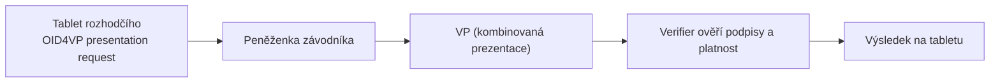

Na soutěži rozhodčí ověřuje, že závodník má platný **průkaz závodníka** a **startovní lístek** pro danou akci. Ověření probíhá výhradně přes **klubový terminál** (RP Instance `rp-referee`) — rozhodčí nepoužívá vlastní peněženku jako verifier.

## User journey — rozhodčí

1. Přihlásí se do **webové aplikace rozhodčích** na klubovém tabletu (klubovým průkazem s rolí `rozhodčí`)
2. Vybere aktuální soutěž ze seznamu
3. U vstupu na střeliště nebo v sekretariátu zahájí ověření:
   - naskenuje QR kód z peněženky závodníka, NEBO
   - závodník otevře deeplink zobrazený na tabletu
4. Proběhne **vzdálená [[OID4VP]]** transakce — tablet jako RP Instance `rp-referee`
5. Systém ověří:
   - platný průkaz závodníka (`license_status: platný`, správná sezóna)
   - platný startovní lístek (`competition_id` odpovídá, `status: platný`, čas v rozsahu)
6. Zobrazí výsledek: ✓ povolen vstup / ✗ zamítnuto s důvodem
7. Závodník se zapíše do listiny účastníků

## User journey — závodník

1. Otevře peněženku a vybere **prezentovat průkazy**
2. Vidí **jednu kombinovanou žádost**: *„Ověření pro Jarní pohár 2026 — stanoviště rozhodčího"*
3. V jednom consent dialogu sdílí průkaz závodníka + startovní lístek (selektivně jen požadované atributy)
4. Obdrží potvrzení o úspěšném ověření

## Technický průběh

Rozhodčí tablet je **RP Instance** `rp-referee` — komunikuje s peněženkou výhradně přes **vzdálený [[OID4VP]]** (webová aplikace na `rozhodci.walletmap-club.cz`). Autenticita verifieru: [[WRPAC]] + [[WRPRC]] `iu-rozhodci` v presentation requestu.

Kombinovaná presentation definition požaduje:

- `CompetitorLicense` — atributy: `competitor_id`, `license_status`, `season`
- `CompetitionEntry` — atributy: `competition_id`, `status`, `valid_from`, `valid_until`

> Model **neobsahuje** wallet-to-wallet interakci (rozhodčí jako verifier ze své peněženky). Rozhodčí vždy používá klubem spravovaný terminál.

## Možné důvody zamítnutí

| Důvod | Zobrazení pro rozhodčího |
|-------|--------------------------|
| Expirovaný startovní lístek | „Lístek již neplatí" |
| Špatná soutěž | „Lístek je pro jiný závod" |
| Pozastavený průkaz závodníka | „Průkaz závodníka není platný" |
| Revokovaný průkaz | „Průkaz byl zrušen" |

## Offline režim

Pro odlehlá stanoviště bez spolehlivého připojení může terminál ověřovat lokálně přes **status list** a cached klíče — viz [Revokace a status list](/scenare/strelecky-klub/revokace-a-status-list#kontrola-overovatelem-rp) (ARF VCR_13, cache a offline režim). Vyžaduje předchozí synchronizaci registrace a klíčů na tablet.
