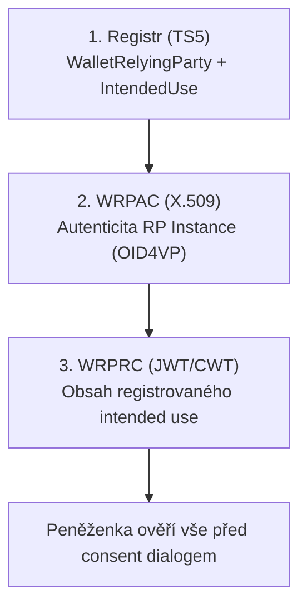

Tento článek prohlubuje [registraci RP](/scenare/strelecky-klub/registrace-rp) o mapování registračních struktur na certifikáty, verifier metadata a obsah presentation requestů.

## Tři vrstvy důvěry RP



## Mapování TS5 → ETSI TS 119 475 (WRPRC)

Každý `IntendedUse` z registru se promítne do **jednoho WRPRC** (*Wallet-Relying Party Registration Certificate*) — **podepsaného JWT** (`typ: rc-wrp+jwt`) nebo **CWT** (`typ: rc-wrp+cwt`) dle **ETSI TS 119 475** §5.2, nikoli do X.509 certifikátu. Tabulka mapování:

| TS5 (registr) | ETSI TS 119 475 (RPRC) | RPRC požadavek |
|---------------|------------------------|----------------|
| `WalletRelyingParty.identifier` | EU-wide unique identifier | RPRC_07 |
| `WalletRelyingParty.legalName` / `tradeName` | User-friendly name | RPRC_06 |
| `IntendedUse.intendedUseIdentifier` | Certificate ID = intended use ID | RPRC_09 |
| `IntendedUse.purpose[]` | User-friendly description of intended use | RPRC_19a-c |
| `IntendedUse.privacyPolicy[]` | Privacy policy URI | RPRC_19a (via ext.) |
| `IntendedUse.credentials[]` | Registered attributes list | RPRC_21 |
| `Credential.format` + `Credential.meta` | Attestation type identifier | Annex V CIR 848 |
| `Claim.path[]` | Registered attribute paths | RPRC_21 |
| `WalletRelyingParty.registryURI` | Registrar online service URL | RPRC_18, RPRC_19a-d |
| `WalletRelyingParty.supportURI[]` | Data deletion contact | RPRC_11 |
| `WalletRelyingParty.supervisoryAuthority` | DPA name, country, contact | RPRC_12 |
| `WalletRelyingParty.usesIntermediary` | Association to intermediary | RPRC_04 |

<details>
<summary>Příklad — payload WRPRC pro iu-klub-app (dekódovaný)</summary>

```json
{
  "wrpIdentifier": "urn:eudi:CZ:EUID:…",
  "wrpName": "Střelecký klub Brno",
  "intendedUseIdentifier": "iu-klub-app",
  "intendedUseDescription": [
    { "lang": "cs", "content": "Přihlášení člena do klubové webové aplikace" }
  ],
  "privacyPolicyURI": "https://walletmap-club.cz/gdpr/app",
  "registryURI": "https://registry.eudi.cz/api/v1",
  "registeredCredentials": [
    {
      "format": "dc+sd-jwt",
      "vct": "urn:walletmap:club:membership:1",
      "claims": ["member_id", "given_name", "family_name", "membership_level", "roles", "status", "valid_until"]
    }
  ],
  "dataDeletionContact": {
    "email": "podpora@walletmap-club.cz",
    "webForm": "https://walletmap-club.cz/podpora"
  },
  "supervisoryAuthority": {
    "name": "Úřad pro ochranu osobních údajů",
    "country": "CZ",
    "formURI": "https://www.uoou.cz/"
  }
}
```

</details>

## WRPAC a verifier metadata

Každá RP Instance publikuje **verifier metadata** (OpenID4VP) a autentizuje se **WRPAC** — X.509 access certifikátem dle **[ETSI TS 119 411-8](https://www.etsi.org/deliver/etsi_ts/119400_119499/11941108/01.01.01_60/ts_11941108v010101p.pdf)** (viz [Registrace vydavatele](/scenare/strelecky-klub/registrace-vydavatele) a [Registrace RP](/scenare/strelecky-klub/registrace-rp), prohloubení access certifikátu). Držitel instance generuje klíčový pár, zasílá CSR vydavateli access certifikátů a privátním klíčem podepisuje presentation request.

### client_id vázaný na certifikát

Dle ARF (RPA_02) a HAIP používá RP Instance prefix `x509_san_dns` nebo `x509_hash`:

<details>
<summary>Verifier metadata — rp-app (klubová aplikace)</summary>

```json
{
  "client_id": "x509_san_dns:app.walletmap-club.cz",
  "client_name": "Klubová aplikace — Střelecký klub Brno",
  "client_uri": "https://walletmap-club.cz",
  "logo_uri": "https://walletmap-club.cz/logo.svg",
  "redirect_uris": ["https://app.walletmap-club.cz/oid4vp/callback"],
  "response_types_supported": ["vp_token"],
  "vp_formats_supported": {
    "dc+sd-jwt": { "alg_values_supported": ["ES256"] }
  },
  "request_object_signing_alg_values_supported": ["ES256"]
}
```

</details>

Access certifikát (WRPAC) pro `app.walletmap-club.cz` musí mít SAN DNS odpovídající `client_id`. Peněženka ověří shodu certifikátu s metadata, profil dle TS 119 411-8 a řetěz vůči LoTE.

<details>
<summary>Verifier metadata — rp-lock-range (zámek střeliště, proximity)</summary>

```json
{
  "client_id": "x509_san_dns:zamek-streliste.walletmap-club.cz",
  "client_name": "Zámek střeliště",
  "response_types_supported": ["vp_token"],
  "vp_formats_supported": {
    "dc+sd-jwt": { "alg_values_supported": ["ES256"] }
  },
  "authorization_encrypted_response_alg_values_supported": ["ECDH-ES"],
  "authorization_encrypted_response_enc_values_supported": ["A128GCM"]
}
```

</details>

## Presentation request — rozšíření dle RPRC_19a

Každý OID4VP request od RP Instance musí obsahovat:

| Pole (RPRC_19a) | Zdroj | Příklad |
|-----------------|-------|---------|
| a) user-friendly name | RPRC / registr | „Střelecký klub Brno" |
| b) unique identifier | `wrpIdentifier` | `urn:eudi:CZ:EUID:…` |
| c) intended use description | `IntendedUse.purpose` | „Přihlášení do aplikace" |
| d) Registrar URL | `registryURI` | `https://registry.eudi.cz/api/v1` |
| e) intended use ID | `intendedUseIdentifier` | `iu-klub-app` |

Plus dle **RPRC_19**: celý WRPRC (JWS compact string) **by value** (ne odkaz).

<details>
<summary>Presentation request — iu-klub-app (kompletní koncept)</summary>

```json
{
  "client_id": "x509_san_dns:app.walletmap-club.cz",
  "response_type": "vp_token",
  "response_mode": "direct_post",
  "nonce": "n-8f3k2j1",
  "presentation_definition": {
    "id": "iu-klub-app",
    "purpose": "Přihlášení do klubové aplikace",
    "input_descriptors": [
      {
        "id": "club_membership",
        "format": { "dc+sd-jwt": { "vct": "urn:walletmap:club:membership:1" } },
        "constraints": {
          "fields": [
            { "path": ["$.member_id"] },
            { "path": ["$.status"], "filter": { "const": "aktivní" } },
            { "path": ["$.valid_until"] }
          ]
        }
      }
    ]
  },
  "eudi_rp_info": {
    "wrp_name": "Střelecký klub Brno",
    "wrp_identifier": "urn:eudi:CZ:EUID:…",
    "intended_use_description": "Přihlášení člena do klubové webové aplikace",
    "registry_uri": "https://registry.eudi.cz/api/v1",
    "intended_use_identifier": "iu-klub-app"
  },
  "eudi_rp_registration_certificate": "eyJhbGciOiJFUzI1NiIsInR5cCI6InJjLXdycCtqd3QifQ.eyJpbnRlbmRlZF91c2VfaWRlbnRpZmllciI6Iml1LWtsdWItYXBwIn0.signature"
}
```

</details>

> Přesný název extension (`eudi_rp_info`) se řídí ETSI TS 119 472-2 a připravovaným CIR — v dokumentaci používáme konceptuální názvy.

## Ověření peněženkou — krok za krokem

1. **WRPAC** (X.509, TS 119 411-8) — ověří podpis, platnost, profil, řetěz vůči LoTE; spáruje s `client_id`. Privátní klíč drží RP instance, certifikát vydala ACA po CSR.
2. **WRPRC** (JWT/CWT, TS 119 475 §5.2, RPRC_17) — ověří podpis AdES B-B a `x5c` vůči Provider of registration certificates
3. **Registr** (RPRC_18) — pokud RPRC chybí, dotaz `GET /wrp?intendeduseidentifier=iu-klub-app`
4. **Claims** (RPRC_21) — porovná `input_descriptors` s registrovanými claims; varování při přebytku
5. **Consent** (RPA_07) — zobrazí název RP, účel, privacy policy, seznam sdílených atributů

<details>
<summary>TS5 API — dotaz peněženky na registr (fallback)</summary>

```http
GET /wrp?intendeduseidentifier=iu-zamek-streliste HTTP/1.1
Host: registry.eudi.cz
Accept: application/json
```

Odpověď (JWS-signed JSON) obsahuje `WalletRelyingParty` včetně `intendedUse` a historii access certifikátů — bez fyzické adresy (CIR 848 Annex II).

</details>

## Mapování intended use → RP Instance → presentation

| intended use | RP Instance | client_id | RPRC | Scénář |
|--------------|-------------|-----------|------|--------|
| `iu-klub-app` | rp-app | `x509_san_dns:app.…` | ✓ | [Přihlášení](/scenare/strelecky-klub/prihlaseni-klubove-aplikace) |
| `iu-reg-zavodnik` | rp-app | `x509_san_dns:app.…` | ✓ | [Registrace závodníka](/scenare/strelecky-klub/registrace-zavodnika) |
| `iu-zamek-zazemi` | rp-lock-back | `x509_san_dns:zamek-zazemi.…` | ✓ | [Zázemí](/scenare/strelecky-klub/pristup-spravce-zazemi) |
| `iu-zamek-streliste` | rp-lock-range | `x509_san_dns:zamek-streliste.…` | ✓ | [Střeliště](/scenare/strelecky-klub/pristup-streliste) |
| `iu-rozhodci` | rp-referee | `x509_san_dns:rozhodci.…` | ✓ | [Rozhodčí](/scenare/strelecky-klub/rozhodci-overeni-zavodnika) |

Jedna RP Instance může obsluhovat více intended uses (rp-app má dvě), ale každý request nese **právě jeden** RPRC odpovídající aktuálnímu účelu.

## Státní doklady v registraci (iu-reg-zavodnik)

Pro PID a zbrojní oprávnění klub registruje credential typy **státního vydavatele**:

<details>
<summary>RPRC — registrované státní credential typy</summary>

```json
{
  "intendedUseIdentifier": "iu-reg-zavodnik",
  "registeredCredentials": [
    {
      "format": "dc+sd-jwt",
      "vct": "urn:eudi:pid:1",
      "claims": ["given_name", "family_name", "birth_date"]
    },
    {
      "format": "dc+sd-jwt",
      "vct": "urn:czechia:zbrojni-opravneni:1",
      "claims": ["license_number", "valid_until", "categories"]
    }
  ]
}
```

</details>

Peněženka ověří, že klub smí tyto atributy žádat — a zároveň že presentation request nepřekračuje registrovaný rozsah. Všechny credential typy se předkládají v **jedné kombinované prezentaci** (více `input_descriptors`, jeden consent dialog).

<details>
<summary>Presentation request — iu-reg-zavodnik (kombinovaná prezentace)</summary>

```json
{
  "client_id": "x509_san_dns:app.walletmap-club.cz",
  "response_type": "vp_token",
  "response_mode": "direct_post",
  "nonce": "n-reg-zavodnik-01",
  "presentation_definition": {
    "id": "iu-reg-zavodnik",
    "purpose": "Ověření totožnosti a zbrojního oprávnění při registraci závodníka",
    "input_descriptors": [
      {
        "id": "pid",
        "format": { "dc+sd-jwt": { "vct": "urn:eudi:pid:1" } },
        "constraints": {
          "fields": [
            { "path": ["$.given_name"] },
            { "path": ["$.family_name"] },
            { "path": ["$.birth_date"] }
          ]
        }
      },
      {
        "id": "gun_license",
        "format": { "dc+sd-jwt": { "vct": "urn:czechia:zbrojni-opravneni:1" } },
        "constraints": {
          "fields": [
            { "path": ["$.license_number"] },
            { "path": ["$.valid_until"] },
            { "path": ["$.categories"] }
          ]
        }
      }
    ]
  },
  "eudi_rp_info": {
    "wrp_name": "Střelecký klub Brno",
    "wrp_identifier": "urn:eudi:CZ:EUID:…",
    "intended_use_description": "Ověření totožnosti a zbrojního oprávnění při registraci závodníka",
    "registry_uri": "https://registry.eudi.cz/api/v1",
    "intended_use_identifier": "iu-reg-zavodnik"
  },
  "eudi_rp_registration_certificate": "eyJhbGciOiJFUzI1NiIsInR5cCI6InJjLXdycCtqd3QifQ.eyJpbnRlbmRlZF91c2VfaWRlbnRpZmllciI6Iml1LXJlZy16YXZvZG5payJ9.signature"
}
```

</details>

## Vydavatel jako RP v jednom transakčním toku

Při vydání CompetitorLicense klub:

1. jako **RP** (`iu-reg-zavodnik`) v **kombinované prezentaci** ověří PID + zbrojní oprávnění
2. jako **Issuer** nabídne CompetitorLicense

Oba kroky používají stejný `wrpIdentifier`, ale různé role a certifikáty:

| Krok | Role | Certifikát |
|------|------|------------|
| Ověření státních dokladů | Service_Provider | WRPAC + WRPRC `iu-reg-zavodnik` |
| Vydání průkazu | Non_Q_EAA_Provider | Issuer access cert (X.509) + WRPRC s `provides_attestations` |

## Distribuce certifikátů (RPRC_10)

Po registraci klub distribuuje:

| Certifikát | Kam |
|------------|-----|
| RPRC `iu-klub-app` + `iu-reg-zavodnik` | server `rp-app` |
| RPRC `iu-zamek-zazemi` | embedded zařízení zámku zázemí |
| RPRC `iu-zamek-streliste` | embedded zařízení zámku střeliště |
| RPRC `iu-rozhodci` | tablet rozhodčího |

WRPAC (access certifikáty) se distribuují stejně — jeden na instanci.

## Připravujeme dále

- Offline verifikace u zámků (cached RPRC + status list)
- Intermediary pro provozovatele HW zámků (Topic 52)
- Přesné OID4VP extension OID dle finálního CIR
