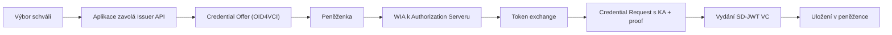

Po podání žádosti výbor schválí členství v klubové aplikaci. Teprve pak klub jako **vydavatel** nabídne průkaz do peněženky.

## User journey — člen výboru / předseda

1. Přihlásí se do **klubové aplikace** klubovým průkazem (musí mít roli výboru nebo předsedy)
2. Zobrazí seznam čekajících žádostí
3. Prohlédne údaje zájemce
4. Schválí nebo zamítne žádost

### Pravidlo čtyř očí

Schválení musí provést:

- **předseda výboru** (samostatně), NEBO
- **dva členové výboru**, NEBO
- **předseda + jeden člen výboru**

Aplikace eviduje oba podpisy s časovým razítkem.

## User journey — nový člen (po schválení)

1. Obdrží notifikaci (e-mail + volitelně push do peněženky)
2. Otevře **credential offer** — deeplink nebo QR kód
3. Peněženka zobrazí náhled průkazu (název klubu, platnost, role)
4. Člen potvrdí → průkaz se uloží
5. Může se přihlásit do klubové aplikace

## Technický průběh — vydavatel (Issuer)

Detail WIA/KA atestací a jejich role při revokaci peněženky: [Vydávání, metadata a revokace](/scenare/strelecky-klub/issuer-prohloubeni-vydavani#wua-wia-ka).

Klíčové úkoly vydavatele:

1. Sestavit payload průkazu dle schématu `ClubMembership`
2. Podepsat průkaz klubovým certifikátem
3. Zaznamenat vydání do auditu
4. Publikovat případnou aktualizaci status listu

## Zamítnutí žádosti

Pokud výbor zamítne:

- žádný průkaz se nevydává
- zájemce dostane odůvodnění e-mailem
- záznam se archivuje

## Co tento scénář neřeší (odkazy na budoucí články)

- Konkrétní formát credential offer URI
- Správa klíčů a HSM
- Notifikační kanály peněženky dle výrobce
