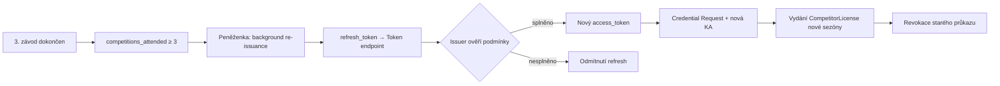

Po ověření státních dokladů klub vydá **průkaz závodníka** platný jednu sezónu. Průkaz (`CompetitorLicense`) podporuje **automatickou obnovu na pozadí** — peněženka prodlouží credential bez opětovné registrace, pokud závodník v aktuální sezóně absolvoval alespoň **3 závody** evidované v klubovém systému.

## Podmínky automatické obnovy

Hodnocení způsobilosti probíhá **mimo platební tok peněženky** — klub počítá účasti ze startovních lístků a výsledkových listin v soutěžní databázi. Peněženka se nepodílí na evidenci závodů ani na rozhodování o způsobilosti.

| Podmínka | Zdroj | Požadavek pro obnovu |
|----------|-------|----------------------|
| Účast na závodech | soutěžní databáze klubu | `competitions_attended ≥ 3` v aktuální sezóně |
| Platné zbrojní oprávnění | členská / závodnická databáze | `gun_license_valid = true` |
| Uložený refresh token | peněženka (z počátečního vydání) | platný `refresh_token` z [[OID4VCI]] vydání |

Systém klubu **průběžně eviduje** počet absolvovaných závodů a stav zbrojního oprávnění. Při každém pokusu o refresh issuer znovu ověří podmínky v interních záznamech.

## User journey — závodník (počáteční vydání)

1. Po úspěšné registraci obdrží notifikaci
2. Otevře credential offer v peněžence
3. Vidí náhled: jméno, sezóna, platnost, klub
4. Potvrdí → **průkaz závodníka** se uloží vedle ostatních dokladů
5. V aplikaci klubu vidí stav: „Závodník — sezóna 2026"

## User journey — klub (vydavatel)

1. Systém automaticky (nebo po schválení) sestaví payload `CompetitorLicense`
2. Issuer podepíše a nabídne průkaz; vrátí `refresh_token` pro budoucí obnovu
3. Zaznamená vazbu `competitor_id` ↔ ověřené [[PID]]
4. Nastaví `valid_until` na konec sezóny
5. Inicializuje evidenci `competitions_attended = 0` pro aktuální sezónu

## Automatické prodloužení na další sezónu

### User journey — závodník

1. Během sezóny se účastní závodů (evidence přes startovní lístky)
2. Po dosažení 3. závodu systém označí podmínku obnovy jako **splněnou**
3. Na konci sezóny (nebo při blížícím se vypršení) **peněženka na pozadí** iniciuje obnovu pomocí uloženého `refresh_token`
4. Závodník obdrží notifikaci: „Průkaz závodníka byl automaticky prodloužen na sezónu 2027"
5. Nový průkaz je platný další sezónu — bez nutnosti žádat o prodloužení ani znovu ověřovat zbrojní oprávnění v peněžence

Pokud závodník nesplní podmínku 3 závodů, issuer odmítne refresh. Závodník může požádat o prodloužení standardním postupem s opětovným ověřením zbrojního oprávnění ([[OID4VP]]).

### Technický průběh — obnova na pozadí

Klíčové kroky:

1. Po každém závodě klub inkrementuje `competitions_attended` v soutěžní databázi
2. Před vypršením platnosti peněženka zavolá `reissueDocument(backgroundOnly: true)`
3. Issuer ověří `competitions_attended ≥ 3` a `gun_license_valid = true`
4. Při splnění vydá nový `CompetitorLicense` s aktualizovaným `season` a `valid_until`
5. Peněženka musí použít **novou KA**, která ještě nebyla použita (TS3 §2.4.2)
6. Starý průkaz se **revokuje** na status listu

### Úkoly vydavatele

- Při vydání vrátit `refresh_token` s platností přesahující sezónu
- Průběžně aktualizovat `competitions_attended` po každém závodě
- Při refresh požadavku ověřit podmínky v soutěžní databázi
- Vydat nový průkaz pro další sezónu a revokovat starý
- Zaznamenat událost obnovy do auditu

## Ruční prodloužení (záložní postup)

Pokud závodník nesplní podmínku 3 závodů nebo refresh token vypršel:

1. Závodník požádá o prodloužení (online)
2. Klub znovu ověří platnost **zbrojního oprávnění** ([[OID4VP]])
3. Vydá nový průkaz pro další sezónu (plný [[OID4VCI]] issuance flow)
4. Starý průkaz se revokuje

## Pozastavení a zrušení

| Důvod | Akce |
|-------|------|
| Ztráta zbrojního oprávnění | revokace průkazu závodníka + zrušení refresh tokenu |
| Disciplinární opatření | `license_status: pozastavený`; refresh odmítnut |
| Ukončení registrace závodníka | revokace + zrušení refresh tokenu |
| Nesplnění podmínky 3 závodů | refresh odmítnut; závodník může použít ruční postup |

Závodník s pozastaveným průkazem se nemůže registrovat na soutěže.
