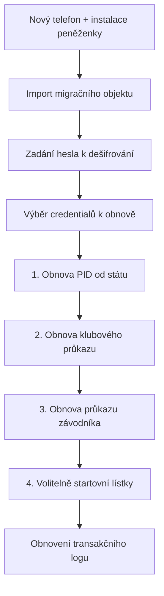

Ztráta telefonu nebo přechod na novou peněženku neznamená ztrátu členství ani registrace závodníka — ale **klubové průkazy v zařízení nelze jednoduše zkopírovat**. Dle [[eIDAS]] a implementačních aktů musí [[EUDIW]] umožnit zálohu a obnovu obsahu peněženky. Tento scénář popisuje, jak to funguje pro držitele **klubového průkazu** a **průkazu závodníka** a jaké povinnosti mají systémy klubu a střelnice.

> **Rozlišení pojmů:** [Automatická obnova členství](/scenare/strelecky-klub/obnova-a-ukonceni-clenstvi) nebo [prodloužení průkazu závodníka](/scenare/strelecky-klub/vydani-prukazu-zavodnika) probíhá **na stejném zařízení** pomocí `refresh_token` z [[OID4VCI]]. **Obnova peněženky** je jiný proces — migrace na novou instanci po ztrátě telefonu nebo změně řešení peněženky.

## Co EUDIW vyžaduje

Evropský rámec (ARF Topic 34, technická specifikace **TS10**) stanoví:

| Požadavek | Význam pro model klubu |
|-----------|------------------------|
| **Migrační objekt** | Peněženka udržuje šifrovaný soubor s inventářem credentialů a transakčním logem |
| **Záloha mimo zařízení** | Uživatel uloží migrační objekt na cloud, disk nebo jiné místo dle podpory řešení peněženky |
| **Obnova na novém zařízení** | Nová peněženka importuje objekt, uživatel zadá heslo, vybere credentialy k obnově |
| **Nové vydání device-bound průkazů** | Klíče zůstávají v [[WSCD]] starého zařízení — nový průkaz musí vydat původní vydavatel |
| **Kopie non-device-bound** | Credentialy nevázané na zařízení lze přenést přímo v migračním objektu |

Procesy a rozhraní pro **nové vydání** při migraci jsou **stejné** jako při prvním vydání (Mig_11) — klub tedy neimplementuje zvláštní „recovery API“, ale musí být schopen standardního [[OID4VCI]] toku kdykoli.

## Migrační objekt — co obsahuje a co ne

Migrační objekt je **heslem chráněný šifrovaný soubor** ([[JWE]]). Dle TS10 obsahuje:

1. **Seznam credentialů** — typ, identifikátor vydavatele, endpoint pro opětovné vydání
2. **Non-device-bound credentialy** — celý obsah (pokud nějaké držitel má)
3. **Transakční log** — historie vydání, prezentací a dalších operací

**Neobsahuje:**

- soukromé klíče ani obsah [[WSCD]]
- hodnoty atributů průkazů (jméno, role, stav členství)
- platný `refresh_token` ze staré peněženky

Migrační objekt je tedy **inventář a návod**, ne záloha samotných průkazů. Bez spolupráce vydavatele (klubu, státu) obnova neproběhne.

## Klubové průkazy jsou device-bound

V tomto modelu jsou `ClubMembership`, `CompetitorLicense` i `CompetitionEntry` **vázané na klíč v peněžence** (`cnf` v [[SD-JWT-VC]]). Při vydání peněženka předkládá [[WIA]] a [[KA]] — viz [prohloubení vydávání](/scenare/strelecky-klub/issuer-prohloubeni-vydavani#wua-wia-ka).

Důsledek pro obnovu:

| Průkaz | Lze zkopírovat v migračním objektu? | Jak obnovit |
|--------|:-----------------------------------:|-------------|
| [[PID]] | ne | Nové vydání od státního PID Providera (priorita před ostatními) |
| Klubový průkaz | ne | Nové vydání od klubu po ověření identity a členství |
| Průkaz závodníka | ne | Nové vydání od klubu po ověření způsobilosti |
| Startovní lístek | ne | Nové vydání pro aktivní soutěž, nebo nová registrace |
| Zbrojní oprávnění (stát) | dle politiky státu | Nové vydání od státního vydavatele |

Starý průkaz na ztraceném telefonu zůstává kryptograficky platný, dokud ho klub **nezrevokuje** — proto je revokace při vydání na nové zařízení povinná.

## User journey — preventivní záloha

1. Držitel v nastavení peněženky zvolí **export / záloha**
2. Peněženka sestaví nebo aktualizuje migrační objekt (průběžně dle Mig_01)
3. Uživatel zvolí heslo a cílové úložiště (cloud poskytovatele peněženky, soubor, …)
4. Objekt se uloží mimo původní zařízení

Doporučení pro člena klubu: zálohu provést **po vydání klubového průkazu** a po každé významné změně (nový průkaz závodníka, startovní lístek na důležitou soutěž).

## User journey — obnova po ztrátě telefonu

### Krok za krokem — člen s oběma průkazy

1. **Aktivace nové peněženky** — nová [[WIA]] a nová [[KA]] pro nové [[WSCD]]
2. **Import zálohy** — uživatel ukáže migrační objekt; bez zálohy musí průkazy získat ručně přes klubovou aplikaci (viz níže)
3. **Obnova [[PID]]** — peněženka iniciuje standardní vydání u státu; uživatel projde autentizací (eID, biometrie dle státu)
4. **Obnova klubového průkazu** — peněženka pošle žádost na klubový issuer endpoint z migračního objektu
5. **Obnova průkazu závodníka** — stejný mechanismus, pokud je v inventáři
6. **Startovní lístky** — krátkodobé; u probíhající soutěže klub vydá nový, u minulých akcí obnova nedává smysl
7. **Transakční log** — uživatel může obnovit historii prezentací (např. návštěvy střelnice)

Pokud uživatel **nemá zálohu**, postupuje přes klubovou aplikaci: přihlášení jiným kanálem (e-mail + MFA), prokázání totožnosti [[PID]] a žádost o nové vydání — technicky stejný [[OID4VCI]] tok jako při prvním vydání.

## Obnova klubového průkazu — co musí zajistit klub

Klub jako **vydavatel (EAA Provider)** musí při obnově na novém zařízení:

### 1. Identifikovat držitele

Issuer při žádosti o nové vydání ověří, že žadatel je tentýž člen:

| Způsob | Kdy |
|--------|-----|
| Prezentace [[PID]] v rámci vydávání | primární — vazba na `member_id` v členské databázi |
| Přihlášení do klubové aplikace + [[OID4VP]] | záložní kanál bez migračního objektu |
| Jednorázový kód z e-mailu / podpora klubu | nouzový režim mimo automatiku |

### 2. Ověřit podmínky členství

Stejná pravidla jako při [automatické obnově](/scenare/strelecky-klub/obnova-a-ukonceni-clenstvi):

- `membership_fees_paid = true` pro aktuální rok
- `status` není `ukončené` ani `vyloučený`
- člen existuje v členské databázi

Bez splnění podmínek issuer vydání **odmítne** — obnova peněženky neobchází pravidla klubu.

### 3. Provést standardní [[OID4VCI]] vydání

1. Peněženka pošle PAR + [[WIA]] na Authorization Server klubu
2. Token exchange s novou atestací instance
3. Credential Request s novou [[KA]] a holder proof
4. Issuer podepíše nový `ClubMembership` s novým `cnf` (nový klíč)
5. Vrátí nový `refresh_token` pro budoucí roční obnovy **na tomto zařízení**

### 4. Zrevokovat starý průkaz

Při úspěšném vydání na nové zařízení issuer:

- nastaví starý credential na status listu jako **revokovaný**
- zneplatní `refresh_token` vázaný na starou instanci peněženky (pokud ještě existuje)
- zaznamená událost do auditu (`credential_reissuance` / migrace)

Detail mechanismů: [Revokace a status list](/scenare/strelecky-klub/revokace-a-status-list).

### 5. Udržovat issuer metadata a dostupnost

| Požadavek | Proč |
|-----------|------|
| Veřejný `/.well-known/openid-credential-issuer` | nová peněženka musí najít endpoint z migračního objektu |
| Platný access certifikát vydavatele vůči [[LoTE]] | bez něj peněženka žádost nepřijme |
| `providesAttestations` v registraci | shoda typu `ClubMembership` |
| Členská databáze online | ověření `membership_fees_paid` a stavu |

## Obnova průkazu závodníka — specifika

Obnova průkazu závodníka navazuje na platné členství a evidenci v soutěžní databázi:

| Podmínka | Zdroj | Poznámka při migraci |
|----------|-------|----------------------|
| Platný klubový průkaz | členská databáze | nejdřív obnovit členství, pak závodníka |
| `competitions_attended ≥ 3` (pro sezónní prodloužení) | soutěžní databáze | platí až pro *background refresh*, ne pro migraci |
| `gun_license_valid = true` | interní příznak + státní doklad | issuer může vyžádat novou prezentaci zbrojního oprávnění |
| Aktivní registrace závodníka | soutěžní databáze | `competitor_status = aktivní` |

Při **migraci** (ne sezónní obnově) issuer vydá průkaz závodníka s **aktuálními atributy** dle databáze — obdobně jako při [vydání po registraci](/scenare/strelecky-klub/vydani-prukazu-zavodnika). Uživatel nemusí znovu absolvovat celou registrační prezentaci [[PID]] + zbrojní oprávnění, pokud klub držitele již identifikoval a záznamy jsou platné.

Nový `refresh_token` se váže na novou peněženku; starý ztracený telefon již nelze použít pro background re-issuance.

## Startovní lístky a krátkodobé credentialy

`CompetitionEntry` má platnost **po dobu konkrétní soutěže**. Při obnově peněženky:

- **probíhající soutěž** — klub může vydat nový lístek (stejný [[OID4VCI]] tok, ověření registrace v databázi)
- **budoucí soutěž** — držitel se znovu [přihlásí na závod](/scenare/strelecky-klub/registrace-na-soutez)
- **minulé akce** — obnova nedává smysl; záznam zůstane v transakčním logu

## Co musí zajistit systémy střelnice

Střelnice v modelu klubu vystupují jako [[Verifier]] / [[RP]] — **ne jako vydavatel**. Při obnově peněženky na ně **nepřipadá technická role zálohování ani obnovy credentialů**.

| Systém střelnice | Povinnost při obnově peněženky | Nepotřebuje |
|------------------|-------------------------------|-------------|
| Zámek střeliště (`iu-zamek-streliste`) | Ověřovat **aktuální** platný průkaz z nové peněženky dle [přístupu na střeliště](/scenare/strelecky-klub/pristup-streliste) | Přístup k migračnímu objektu |
| Zámek zázemí (`iu-zamek-zazemi`) | Stejně — platný klubový průkaz se správnou rolí | Ukládat kopie credentialů z minulých zařízení |
| Terminál rozhodčího | Ověřit nový startovní lístek / průkaz závodníka | Re-vydávat průkazy |

### Doporučené chování ověřovatelů

1. **Kontrolovat status list** při každé prezentaci — starý průkaz ze ztraceného telefonu musí být odmítnut po revokaci klubem
2. **Nespoléhat na lokální cache** vázanou na starý `cnf` nebo serial credentialu
3. **Nevyžadovat „re-registraci“** u zámku — stačí platný průkaz z nové peněženky
4. **Audit** — nové prezentace po obnově vypadají jako běžný přístup; není potřeba zvláštní režim

Jediný předpoklad: klub musí **včas revokovat** staré credentialy a **vydat nové** — teprve pak zámky a terminály akceptují obnovenou peněženku.

## Přehled odpovědností

| Strana | Záloha | Obnova device-bound průkazů | Ověření po obnově |
|--------|:------:|:-----------------------------:|:-----------------:|
| Držitel peněženky | export migračního objektu, bezpečné heslo | import, výběr credentialů, autentizace u vydavatelů | předkládá nové průkazy |
| Wallet Provider | formát TS10, šifrování, úložiště zálohy | import, orchestrace žádostí o vydání | nová [[WIA]] / [[KA]] |
| Klub (issuer) | — | identifikace člena, kontrola podmínek, [[OID4VCI]] vydání, revokace starého | — |
| Stát (PID, zbroják) | — | nové vydání státních dokladů | — |
| Střelnice (verifier) | — | — | standardní [[OID4VP]] kontrola |

## Typické situace

Ztráta telefonu bez zálohy — aktivní člen a závodník

1. Člen nainstaluje novou peněženku
2. Získá [[PID]] od státu (standardní proces)
3. Přihlásí se do klubové aplikace přes e-mail + MFA nebo prezentací [[PID]]
4. Aplikace nabídne **nové vydání** klubového průkazu a průkazu závodníka (deeplink)
5. Issuer ověří identitu a databázi, zrevokuje staré průkazy
6. Člen může na střelnici i na závodě — po vydání nových credentialů

Záloha existuje — rychlá obnova

1. Import migračního objektu do nové peněženky
2. Peněženka postupně požádá stát o [[PID]], klub o `ClubMembership` a `CompetitorLicense`
3. Uživatel potvrdí jednotlivé nabídky (credential offer)
4. Celý proces bez návštěvy klubu, pokud jsou podmínky v databázi splněny

Nezaplacený příspěvek v době ztráty telefonu

1. Obnova klubového průkazu bude **odmítnuta** (stejně jako background refresh)
2. Člen doplatí příspěvek v klubové aplikaci (mimo peněženku)
3. Po připsání platby může znovu požádat o vydání — až poté obnovit průkaz závodníka

Vyloučení člena mezi ztrátou a obnovou

1. Výbor nastaví `status: vyloučený` a revokuje průkazy
2. Žádost o nové vydání při migraci bude odmítnuta
3. Migrační objekt sice obsahuje záznam o starém průkazu, ale issuer už nevydá

## Související scénáře

| Téma | Scénář |
|------|--------|
| Roční obnova členství (stejné zařízení) | [Obnova a ukončení členství](/scenare/strelecky-klub/obnova-a-ukonceni-clenstvi) |
| Sezónní prodloužení závodníka | [Vydání průkazu závodníka](/scenare/strelecky-klub/vydani-prukazu-zavodnika) |
| Revokace starého průkazu | [Revokace a status list](/scenare/strelecky-klub/revokace-a-status-list) |
| WIA/KA při novém vydání | [Prohloubení vydávání](/scenare/strelecky-klub/issuer-prohloubeni-vydavani) |
| Přístup po obnově | [Přístup na střeliště](/scenare/strelecky-klub/pristup-streliste) |
| První vydání členství | [Schválení a vydání členství](/scenare/strelecky-klub/schvaleni-a-vydani-clenstvi) |
